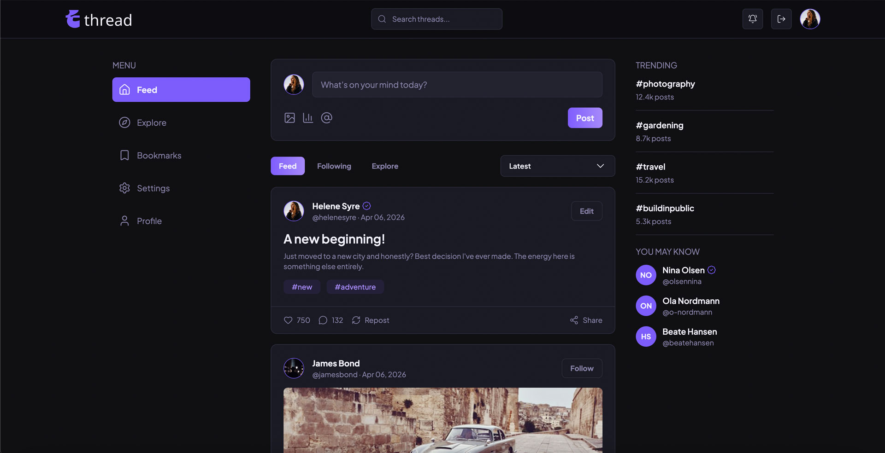

# CSS-frameworks-helene-syre

**Desktop:** 

This is my CSS Frameworks project, where I have used TailwindCSS to style a social media application. The project is called Thread, and it is a platform where users can share their thoughts and ideas with others. The project is built with HTML, CSS, JavaScript, and TailwindCSS.

Project Link: [https://helenesyre.github.io/CSS-frameworks-helene-syre/index.html](https://helenesyre.github.io/CSS-frameworks-helene-syre/index.html)

---

## Description

The project consists of three main pages: the authentication page, the feed page, and the profile page. The authentication page allows users to log in or register for the application. The feed page displays a list of posts with thumbnails, a search bar, sort options, and a form to create a new post. The profile page includes a profile image, username, list of user posts, a follow button, and an area to display following/followers. The project is designed to be responsive and works well on both desktop and mobile devices.

## Features:

- **Login** – The user can log in and access their account.
- **Register** – The user can register a new account on the register page.
- **Profile** – The user can view their profile page with their profile image, username, list of posts, a follow button, and an area to display following/followers.
- **Feed** – The user can view the feed page with a list of posts with thumbnails, a search bar, sort options, and a form to create a new post.
- **Responsive Design** – The application is designed to be responsive and works well on both desktop and mobile devices, with a desktop navbar and mobile bottom navigation.

## Project Structure

Here’s an overview of the folders and files in this project:

```
├── index.html
├── profile/
│   └── index.html
├── feed/
│   └── index.html
├── register/
│   └── index.html
├── package.json
├── package-lock.json
├── README.md
├── tailwind.config.js
├── .gitignore
├── .prettierrc
├── docs/
│   └── AI_LOG.md
├── css/
│   ├── input.css
│   └── style.css
├── js/
│   ├── modal/
│   │   └── createModal.js
│   ├── nav/
│   │   ├── logo.js
│   │   └── nav.js
├── assets/
│   ├── favicon/
│   ├── images/
│   │   ├── posts/
│   │   ├── profile/
│   │   └── readme/
│   └── logo/
├── node_modules/
```

## Built With

Main tools and technologies used in this project:


---

## Installation

Follow these steps to get a copy of the project running locally:

1. Clone the repository:

   ```bash
   git clone https://github.com/helenesyre/CSS-frameworks-helene-syre.git
   ```

2. Open the repository:

   ```bash
    cd CSS-frameworks-helene-syre
   ```

3. Run Local Server

   Install dependencies and start the development server:

   ```bash
   npm install
   npm run dev
   ```

## Available Scripts

In the project directory, you can run:

- `npm run dev` – Starts the development server and watches for changes in your files.
- `npm run build` – Builds the project for production by compiling and minifying the CSS using TailwindCSS.
- `npm run format` – Formats the code using Prettier.
- `npm run format:check` – Checks if the code is formatted correctly using Prettier.

---

## Contact

Helene Syre - [@syre_design](https://www.instagram.com/syre_design/) - syrehelene@gmail.com - [Linkedin](https://www.linkedin.com/in/helene-syre/) - [Portfolio](https://helenesyre.github.io/portfolio/#/)
